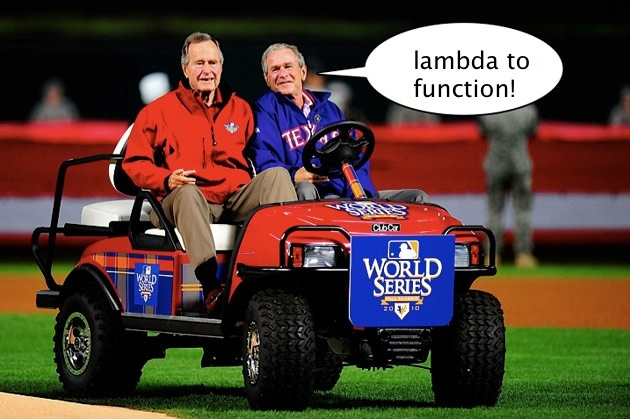

!SLIDE
# Functional Javascript
### anders.janmyr@jayway.com
### http://anders.janmyr.com
### @andersjanmyr

!SLIDE center transition=blindZ
# Short History

.notes The Wild West of the Internet

!SLIDE center

## Brendan Eich

.notes Supremely smart fellow, make a programming language for browser, steals code

!SLIDE
# Scheme

    @@@python
    (define map
      (lambda (list f)
        (if (null? list)
          nil
          (cons (f (car list))
            (map (cdr list) f)))))

!SLIDE center
# George Bush Jr.

.notes Visited from Texas to invest some oil money in this new hype
called the internet. 
Daddy, daddy, there is this german dude, that is trying to put
a foreign programming language into an american browser.

!SLIDE center
# George Bush Sr.

.notes Head of the CIA, at the time. 
How do you know its not american?
It has these weird sounding names in it, LAMBDA and stuff.
We can't have that!

!SLIDE center
# Big George Makes Some Calls

!SLIDE center

## Brendan Eich
.notes Pissed off, but what can he do?

!SLIDE
# Scheme

    @@@python
    (define map
      (lambda (list f)
        (if (null? list)
          nil
          (cons (f (car list))
            (map (cdr list) f)))))

!SLIDE
# SchemeScript

    @@@python
    (define map
      (function (list f)
        (if (null? list)
          nil
          (cons (f (car list))
            (map (cdr list) f)))))

!SLIDE center
# The Bushes

.notes Daddy, daddy, all he did was change the name, he's mocking me!
Big George goes, Look here fellow, you better change it some more or
we'll deport your ass!

!SLIDE center
# Big George Makes Some More Calls

!SLIDE
# SchemeScript

    @@@python
    (define map
      (function (list f)
        (if (null? list)
          nil
          (cons (f (car list))
            (map (cdr list) f)))))

!SLIDE
# JavaScript

    @@@javascript
    var map =
      function(list, f) {
        if (!list) {
          return [];
        } else {
          var car = list.shift();
          return map(list, f).unshift(f(car));
        }
      }

!SLIDE center
# Little George Happy

.notes With that little george is happy.

